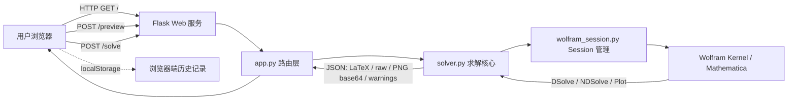
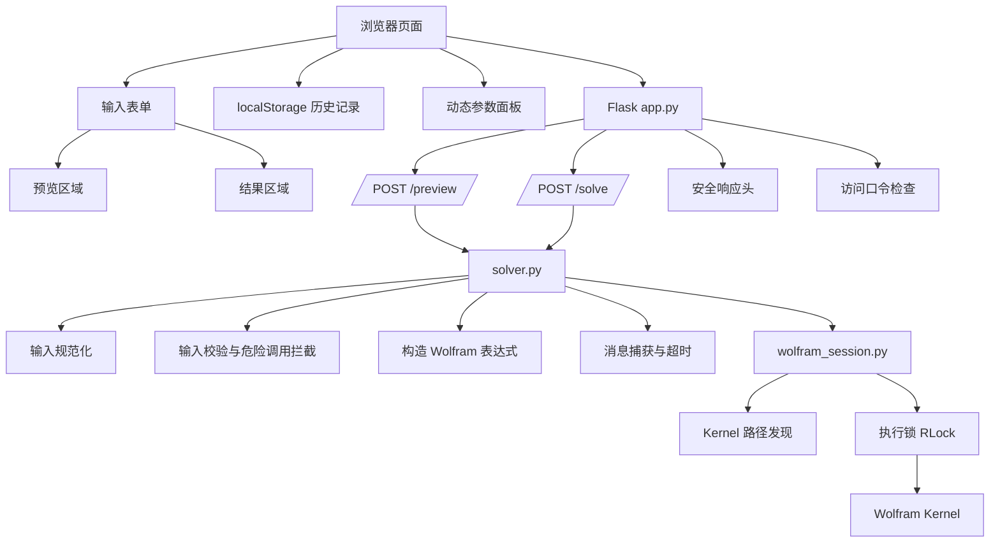
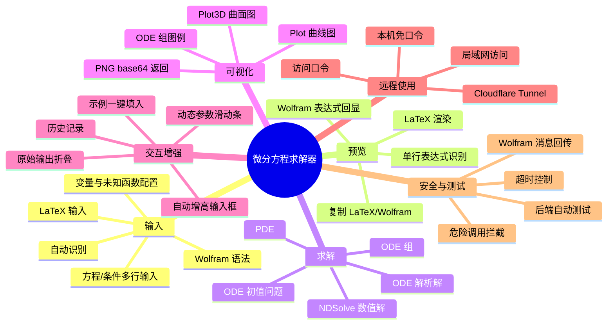
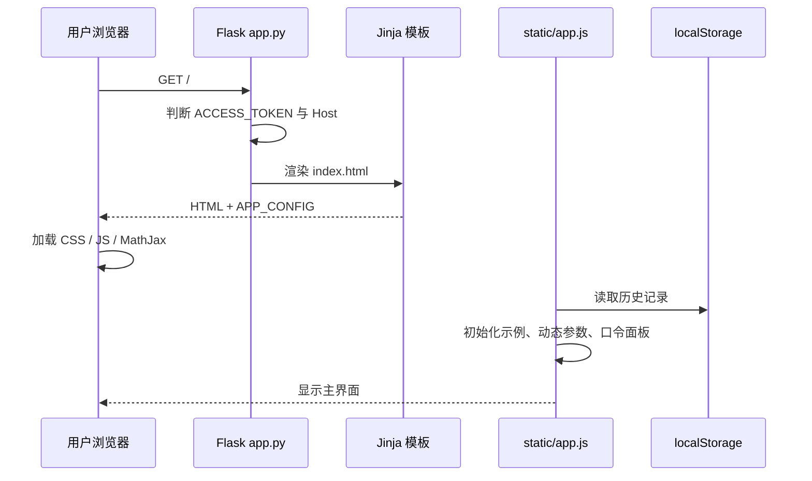
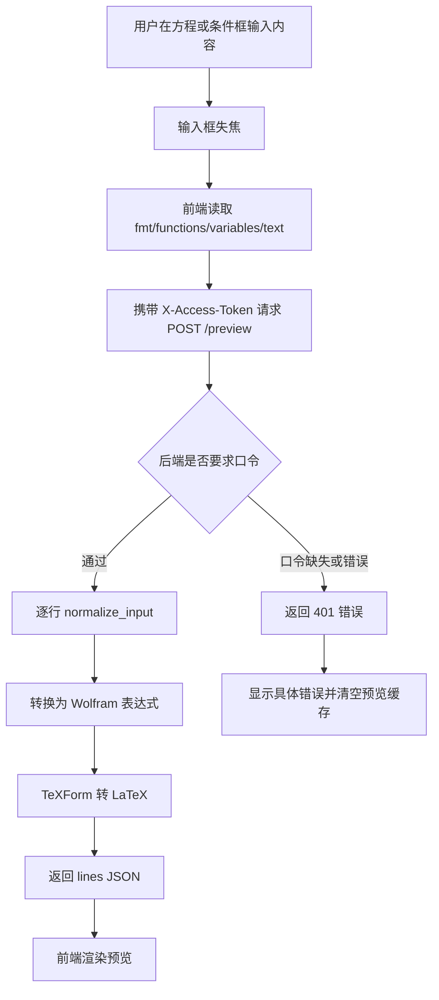
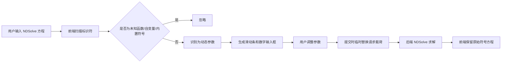
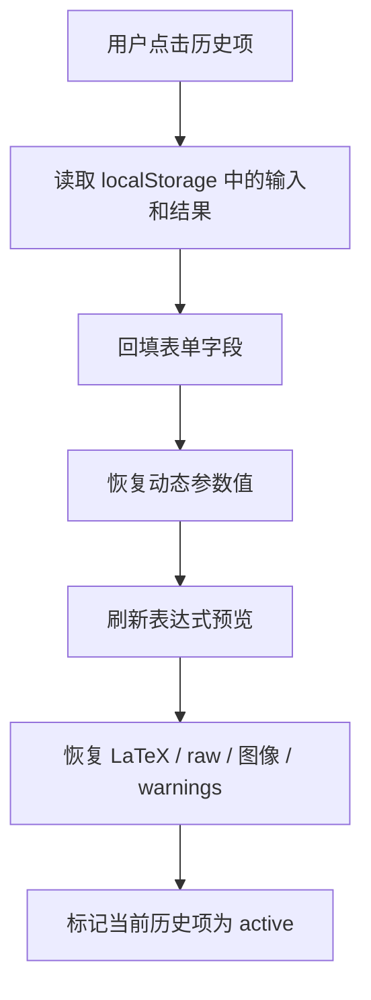
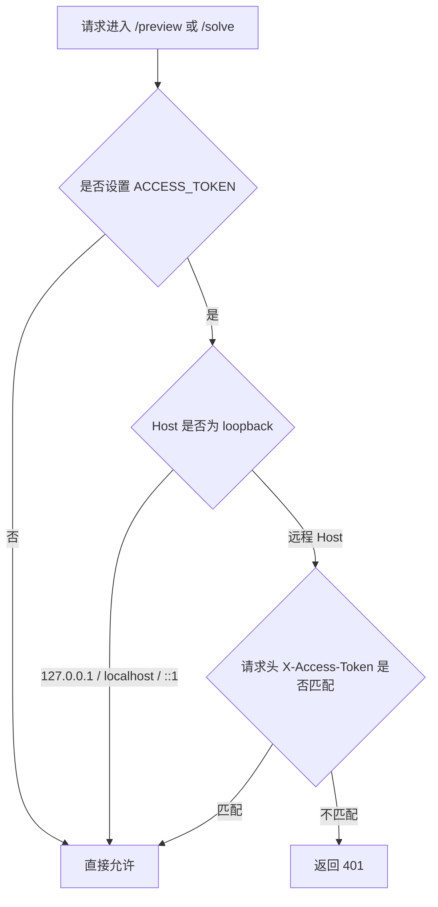

# 微分方程求解器软件功能设计说明书

## 目录

- [1. 文档目的与适用范围](#1-文档目的与适用范围)
- [2. 项目背景、目标与意义](#2-项目背景目标与意义)
- [3. 用户角色与典型使用场景](#3-用户角色与典型使用场景)
- [4. 总体架构设计](#4-总体架构设计)
- [5. 功能模块设计](#5-功能模块设计)
- [6. 核心业务流程设计](#6-核心业务流程设计)
- [7. 输入规范化与数学求解原理](#7-输入规范化与数学求解原理)
- [8. 前端交互与浏览器端状态设计](#8-前端交互与浏览器端状态设计)
- [9. 后端接口与服务端设计](#9-后端接口与服务端设计)
- [10. Wolfram Kernel 管理设计](#10-wolfram-kernel-管理设计)
- [11. 配置项与部署方案](#11-配置项与部署方案)
- [12. 安全、鲁棒性与限制](#12-安全鲁棒性与限制)
- [13. 测试设计与验收方案](#13-测试设计与验收方案)
- [14. 运维排错与演示建议](#14-运维排错与演示建议)
- [15. 后续可扩展方向](#15-后续可扩展方向)

## 1. 文档目的与适用范围

本文档用于说明当前目录下“微分方程求解器”项目的软件功能设计、运行原理、模块划分、交互流程、配置部署方案、安全限制与测试方案。文档面向以下读者：

- 项目开发者：理解代码结构、模块职责、关键流程和后续维护方向。
- 演示者或教师：理解软件能解决什么问题、如何部署、如何向他人开放访问。
- 测试者：理解主要功能点、测试覆盖范围、典型用例和验收标准。
- 未来接手者：在不逐行阅读全部代码的前提下，快速掌握系统整体设计。

本文档以功能设计和实现原理为主，不展示大篇幅源代码。涉及代码时，只引用文件、模块、函数名或关键配置项。

## 2. 项目背景、目标与意义

### 2.1 项目背景

微分方程是数学分析、常微分方程、偏微分方程、动力系统、数值计算和建模课程中的核心内容。学生在学习过程中经常需要完成以下任务：

- 输入一个 ODE 或 PDE，验证是否存在解析解。
- 为初值问题或边值问题求解特定解。
- 对没有闭式解的模型做数值求解。
- 对数值解进行可视化，观察函数随自变量变化的趋势。
- 修改参数，比较系统行为变化。
- 在课堂或汇报中快速演示多个方程案例。

Mathematica/Wolfram Language 在符号计算和数值计算方面能力强，但直接使用 Mathematica 需要熟悉其语法和界面。该项目将 Mathematica 的求解能力封装成 Web 表单，让用户在浏览器中输入方程并查看结果，从而降低演示和测试成本。

### 2.2 建设目标

本项目的目标不是重新实现一个微分方程求解器内核，而是构建一个教学友好的 Web 外壳，复用本机 Wolfram Kernel 的 `DSolve`、`NDSolve`、`Plot`、`Plot3D` 等能力。

核心目标包括：

- 提供统一网页入口，支持 ODE、ODE 组和 PDE 的输入。
- 支持解析解和数值解两类求解模式。
- 支持 Wolfram 语法、LaTeX 输入和自动识别。
- 将解析结果渲染为可读公式，将数值结果绘制为图像。
- 提供示例一键填入、历史记录、动态参数、预览等演示增强功能。
- 支持本机、局域网、公网临时映射三种使用方式。
- 在远程演示场景下通过访问口令降低误用风险。
- 通过自动化测试覆盖后端核心求解能力。

### 2.3 项目意义

该软件的意义主要体现在三个方面：

- 教学演示：教师或学生可以快速切换不同方程类型、初值条件和参数，直观看到公式结果或图像结果。
- 协作便利：只有一台电脑安装 Mathematica 时，也可以通过局域网或公网映射让其他同学用浏览器访问。
- 工程训练：项目覆盖前端交互、后端 API、第三方计算引擎调用、输入安全校验、远程部署和自动测试，是一个较完整的小型软件系统。

## 3. 用户角色与典型使用场景

### 3.1 用户角色

| 角色 | 主要诉求 | 典型操作 |
|---|---|---|
| 本机使用者 | 在自己电脑上求解和绘图 | 启动 Flask 服务，打开 `127.0.0.1:5001` |
| 演示者 | 快速展示多个方程案例 | 使用内置示例、一键填入、历史记录和图像复制 |
| 局域网访问者 | 自己电脑无 Mathematica，但想使用求解功能 | 访问主机局域网 IP，输入访问口令 |
| 公网临时访问者 | 不在同一局域网，但需要临时试用 | 访问 Cloudflare Tunnel 地址，输入访问口令 |
| 测试维护者 | 验证后端求解和安全校验 | 运行 `backend_tests.py` 的分组测试 |

### 3.2 典型使用场景

1. 本机解析求解：用户输入 `y''[x] + y[x] == 0`，选择 ODE 和解析解，系统返回通解。
2. 初值问题求解：用户补充 `y[0] == 1`、`y'[0] == 0`，系统返回满足初值的特解。
3. ODE 组数值绘图：用户输入二维系统，选择 NDSolve 并勾选绘图，系统返回多曲线图并标注函数名。
4. PDE 数值可视化：用户输入热方程和边界条件，系统返回 3D 曲面图。
5. LaTeX 输入验证：用户输入 `\frac{d^2 y}{dx^2} + y = 0`，系统先预览转换结果，再求解。
6. 参数扫动演示：用户输入包含 `omega` 的数值方程，前端自动生成滑动条，提交时替换参数值。
7. 远程协作：主机开启 `ACCESS_TOKEN` 和端口映射，其他人通过浏览器使用主机上的 Mathematica。

## 4. 总体架构设计

### 4.1 架构概述

系统采用轻量级 Browser/Server 架构。浏览器负责表单输入、预览展示、历史记录、动态参数和结果渲染；Flask 后端负责请求校验、访问口令校验、调用求解模块；求解模块通过 `wolframclient` 复用本机 Wolfram Kernel；Wolfram Kernel 执行符号求解、数值求解和绘图。



### 4.2 分层设计

| 层级 | 文件或组件 | 主要职责 |
|---|---|---|
| 页面结构层 | `templates/index.html` | 定义表单、结果区、历史侧栏、示例区、远程口令输入框 |
| 前端交互层 | `static/app.js` | 表单读取、预览请求、求解请求、历史记录、动态参数、示例填入、结果渲染 |
| 前端样式层 | `static/style.css` | 布局、表单、历史侧栏、预览区、结果区和响应式样式 |
| Web 路由层 | `app.py` | Flask 路由、安全响应头、访问口令、本机免口令、请求解析 |
| 求解服务层 | `solver.py` | 输入规范化、校验、DSolve/NDSolve 调用、绘图、消息捕获、错误封装 |
| Kernel 管理层 | `wolfram_session.py` | WolframKernel 路径发现、Session 单例、执行锁、退出清理 |
| 测试层 | `backend_tests.py` | 后端回归测试、分组测试、慢速用例控制 |
| 文档层 | `README.md`、`DESIGN.md`、`docs/WINDOWS_INSTALL.md`、`docs/TESTING.md`、`docs/TEST_CASES.md` | 安装、使用、设计、测试和用例说明 |

### 4.3 物理文件结构

当前项目核心文件结构如下：

```text
.
├── README.md
├── DESIGN.md
├── app.py
├── solver.py
├── wolfram_session.py
├── backend_tests.py
├── requirements.txt
├── templates/
│   └── index.html
├── static/
│   ├── app.js
│   └── style.css
├── LICENSE
└── docs/
    ├── TESTING.md
    ├── TEST_CASES.md
    ├── WINDOWS_INSTALL.md
    └── screenshot.jpg
```

### 4.4 运行时组件关系



### 4.5 关键设计原则

- 前端不直接接触 Wolfram Kernel，所有计算都通过 Flask 后端统一入口完成。
- 历史记录只保存在浏览器端，不写入后端磁盘，减少隐私和清理成本。
- 后端不尝试保存用户会话状态，除复用 Wolfram Kernel 外，请求本身尽量保持无状态。
- 使用单个 Wolfram Kernel Session 复用启动成本，再用执行锁避免并发请求互相干扰。
- 默认只监听本机地址；远程访问需要显式配置 `HOST`，公网演示建议通过 Cloudflare Tunnel。
- 访问口令只用于远程访问的轻量保护；本机直连根据 `Host` 为 loopback 自动免口令。
- 输入校验以“防止明显误用和高风险调用”为目标，不宣称提供完整沙箱。

## 5. 功能模块设计

### 5.1 功能模块总览



### 5.2 数学输入模块

数学输入模块由前端表单和后端规范化逻辑共同完成。

前端字段包括：

- 输入格式：`Wolfram`、`LaTeX`、`自动识别`
- 方程类型：`ODE`、`ODE 组`、`PDE`
- 求解模式：`解析解 (DSolve)`、`数值解 (NDSolve)`
- 方程：每行一条
- 未知函数：逗号分隔，例如 `y` 或 `x, y`
- 自变量：逗号分隔，例如 `x` 或 `x, t`
- 初值/边值条件：每行一条，可为空
- 绘图区间：例如 `{t, 0, 10}` 或 `{x, 0, Pi}, {t, 0, 1}`
- 绘图开关：控制是否返回曲线图或曲面图

该模块的目的不是让用户完全摆脱 Wolfram 语法，而是通过提示、示例、预览和 LaTeX 预处理，降低常见输入门槛。

### 5.3 表达式预览模块

预览模块用于在正式求解前检查输入是否被系统正确理解。它对应后端 `POST /preview` 路由。

主要能力：

- 将多行输入拆分为多条表达式分别识别。
- 对每一行返回识别结果、LaTeX 渲染内容、Wolfram 表达式或错误信息。
- 提供复制 LaTeX 和复制 Wolfram 表达式按钮。
- 当访问口令变更并失焦时，自动刷新已有方程和条件的预览。
- 预览请求失败时不缓存失败状态，方便用户修正口令或网络后重试。

预览模块的意义：

- 避免用户在输入阶段犯错后直接进入求解，导致错误结果难以定位。
- 帮助用户理解 LaTeX 到 Wolfram 表达式的转换结果。
- 对演示场景非常重要，因为示例填入后可以立即显示识别结果。

### 5.4 求解模块

求解模块是系统核心，对应后端 `POST /solve` 路由和 `solver.py`。

支持的求解类型包括：

| 方程类型 | 解析解 | 数值解 | 绘图 |
|---|---|---|---|
| ODE | 支持 | 支持 | 支持 Plot |
| ODE 组 | 支持 | 支持 | 支持多曲线 Plot + 图例 |
| PDE | 支持尝试 | 支持 | 支持 Plot3D |

解析解通过 Wolfram `DSolve` 完成。数值解通过 Wolfram `NDSolve` 完成。系统不会自己实现符号求解或数值积分算法，而是将输入转为 Wolfram Language 表达式后交给 Kernel。

求解结果包括：

- `ok`：是否成功
- `latex`：解析解的 LaTeX 字符串
- `raw`：Wolfram `InputForm` 原始输出
- `image_base64`：PNG 图像的 base64 字符串
- `normalized_eqs`：规范化后的方程
- `normalized_conds`：规范化后的条件
- `warnings`：Wolfram 消息和系统提示
- `error`：错误信息

### 5.5 绘图模块

绘图模块依赖 Mathematica 的 `Plot`、`Plot3D` 和 `ExportByteArray`。

设计要点：

- 单变量数值解使用 `Plot` 绘制曲线。
- 多未知函数 ODE 组使用同一张 `Plot` 绘制多条曲线。
- ODE 组绘图通过 `PlotLegends -> Placed[..., Right]` 标明每条曲线对应的函数名。
- PDE 数值解默认绘制第一个未知函数的二维自变量曲面图。
- 图像导出为 PNG，再通过 base64 放入 JSON 响应，前端无需读取后端静态文件。

这种设计避免了后端临时图片文件管理，也避免了远程访问时路径和清理问题。

### 5.6 示例模块

前端内置 5 个示例：

1. Wolfram ODE 解析解
2. Wolfram ODE 初值问题
3. ODE 组数值解和绘图
4. PDE 数值解和 3D 绘图
5. LaTeX ODE

每个示例提供“应用此示例”按钮。点击后会：

- 自动设置输入格式、方程类型、求解模式。
- 自动填入方程、未知函数、自变量、条件、绘图区间和绘图选项。
- 自动触发表达式预览。
- 清空旧结果区域，避免用户误以为旧结果对应新输入。

### 5.7 历史记录模块

历史记录保存在浏览器 `localStorage` 中，而不是后端。

设计原因：

- 避免后端保存用户输入，降低隐私和清理成本。
- 方便用户在同一浏览器内回看过去求解过程。
- 便于演示者提前准备多个案例，现场快速切换。

历史记录保存内容包括：

- 输入字段
- 动态参数值
- 求解结果
- 图像 base64
- 创建时间
- 成功/失败状态

当前限制：

- 只保存在当前浏览器和当前站点数据中。
- 默认最多保留最近 16 条。
- 如果图像较大导致 localStorage 空间不足，会自动丢弃较旧记录。

### 5.8 动态参数模块

动态参数模块用于数值解场景。当用户输入的方程中存在未绑定符号，例如 `omega`，前端会尝试识别并生成滑动条。

识别规则概述：

- 仅在 `NDSolve` 数值解模式下启用。
- 已知未知函数和自变量不会被当作参数。
- 常见 Wolfram 内置符号，例如 `Sin`、`Cos`、`Exp`、`Pi` 等不会被当作参数。
- 出现在函数调用位置的标识符不会被当作参数。

提交求解时，前端不会改写页面上的原始方程，而是只在请求载荷中临时把参数名替换为当前数值。这样用户可以保留原始符号表达式，并反复调整滑动条。

### 5.9 远程访问模块

远程访问模块解决“只有主机安装 Mathematica，其他人没有安装”的协作问题。

使用方式包括：

- 本机使用：默认 `HOST=127.0.0.1`
- 局域网共享：设置 `HOST=0.0.0.0`，同一局域网通过主机 IP 访问
- 公网临时演示：保持 `HOST=127.0.0.1`，通过 Cloudflare Tunnel 暴露临时 HTTPS 地址

访问口令设计：

- 设置 `ACCESS_TOKEN` 后，远程访问需要在页面输入口令。
- 前端通过 `X-Access-Token` 请求头提交口令。
- 本机直连 `127.0.0.1`、`localhost`、`::1` 自动免口令。
- 免口令判断基于浏览器请求中的 `Host` 是否为 loopback，而不是 TCP 源地址。这样可以避免 Cloudflare Tunnel 代理到本机后被错误视为本机用户。

## 6. 核心业务流程设计

### 6.1 页面加载流程



页面加载时，后端会把是否需要访问口令写入 `window.APP_CONFIG`。本机直连时即使设置了 `ACCESS_TOKEN`，页面也不会显示口令框；远程访问时会显示。

### 6.2 表达式预览流程



预览失败时前端不会缓存失败状态。这样用户修改口令、恢复网络或后端恢复后，可以重新触发预览。

### 6.3 求解流程

```mermaid
sequenceDiagram
    participant U as 用户
    participant FE as 前端 app.js
    participant API as Flask /solve
    participant S as solver.py
    participant W as wolfram_session.py
    participant K as Wolfram Kernel

    U->>FE: 点击“求解”
    FE->>FE: 表单校验、动态参数替换
    FE->>API: POST /solve JSON
    API->>API: 访问口令检查
    API->>S: 构造 SolveRequest
    S->>S: 校验 fmt/kind/mode/变量/区间/危险调用
    S->>W: get_session + get_eval_lock
    W->>K: 复用或启动 Wolfram Kernel
    S->>K: normalize_input / DSolve 或 NDSolve
    K-->>S: 求解结果与 Wolfram 消息
    alt 需要绘图
        S->>K: Plot/Plot3D + ExportByteArray
        K-->>S: PNG base64
    end
    S-->>API: SolveResult
    API-->>FE: JSON
    FE->>FE: 渲染公式、图像、原始输出、提示
    FE->>FE: 写入 localStorage 历史记录
```



### 6.4 数值解动态参数流程



### 6.5 历史记录恢复流程



历史记录恢复不重新向后端求解，而是展示当时保存的结果。这样恢复速度快，也不会因为当前参数、远程口令或 Kernel 状态变化而改变历史结果。

## 7. 输入规范化与数学求解原理

### 7.1 输入格式处理原则

系统支持三种输入格式：

- `wolfram`：直接将输入视为 Wolfram Language 表达式。
- `latex`：先做少量预处理，再交给 Mathematica 的 `ToExpression[..., TeXForm]` 解析。
- `auto`：根据输入是否包含反斜杠或常见 LaTeX 控制序列判断格式。

这种设计的原则是：尽量把复杂数学解析交给 Mathematica，而不是在 Python 中实现完整 LaTeX 解析器。

### 7.2 LaTeX 预处理原理

LaTeX 输入主要针对常见 ODE 写法做增强：

- Leibniz 一阶导数：`\frac{dy}{dx}` 会先改写为 `y'(x)`。
- Leibniz 高阶导数：`\frac{d^2 y}{dx^2}` 会先改写为 `y''(x)`。
- 裸函数名包装：当已知未知函数为 `y`、自变量为 `x` 时，表达式中的裸 `y` 会改写为 `y(x)`。

这些预处理的目的，是让常见课堂写法更容易被 Mathematica 的 TeXForm 解析为真正的函数和导数。

当前限制：

- PDE 偏导的 LaTeX 写法未做完整支持。
- 复杂 LaTeX 环境、矩阵、分段函数等不是当前主要目标。
- 对 PDE 推荐直接使用 Wolfram 语法，例如 `D[u[x,t], t]`。

### 7.3 Wolfram 语法校验

Wolfram 语法模式下，后端会执行以下校验：

- 单字段最大长度限制。
- 方程中禁止分号，避免复合表达式。
- 禁止 `<<`、`>>` 等文件重定向语法。
- 禁止明显危险的 Wolfram 调用，例如进程、文件、网络、外部执行、二次求值等。
- 检查单等号 `=`，提醒用户 Wolfram 方程应写 `==`。
- 对 `y(x)` 这类圆括号函数应用给出提示，因为 Wolfram 中函数调用应写 `y[x]`。

### 7.4 解析解原理

解析解模式使用 `DSolve`：

- ODE 单方程：未知函数形式为 `y[x]`。
- ODE 组：未知函数形式为 `{x[t], y[t]}`。
- PDE：未知函数形式为 `u[x, t]`，变量形式为 `{x, t}`。

系统会将方程和条件合并为一个列表传入 `DSolve`。返回结果会被转换为：

- `InputForm`：用于原始 Wolfram 输出展示。
- `TeXForm`：用于前端公式渲染。

如果 `DSolve` 无法化简，系统会提示用户改用数值解模式，并补充初值和绘图区间。

### 7.5 数值解原理

数值解模式使用 `NDSolve`。数值解通常需要：

- 足够的方程数量。
- 初值或边界条件。
- 明确的绘图区间或求解区间。
- 合理的参数值。

`NDSolve` 返回的通常是 `InterpolatingFunction`。前端默认显示原始 Wolfram 输出；如果用户勾选绘图，则后端再将该插值函数代入 `Plot` 或 `Plot3D`。

### 7.6 Wolfram 消息捕获原理

Mathematica 在求值过程中可能输出 `NDSolve::underdet`、语法错误、边界条件不足等消息。系统通过在 Wolfram 代码中局部捕获 `$MessageList`，把消息作为 `warnings` 返回前端。

消息回传的意义：

- 用户不仅知道“失败”，还能看到 Wolfram 的具体诊断。
- 测试程序可以验证复杂错误是否被正确反馈。
- 演示时可以说明某些问题是数学条件不足，而不是网页程序崩溃。

### 7.7 超时控制原理

Wolfram 求解可能耗时很长。系统用 `TimeConstrained` 包裹关键求值：

| 类型 | 默认超时 | 目的 |
|---|---:|---|
| 预览 | 约 8 秒 | 避免表达式解析卡住 |
| 求解 | 约 25 秒 | 避免复杂 DSolve/NDSolve 长时间占用 |
| 绘图 | 约 35 秒 | 避免高复杂度图像导出卡住 |

超时后会返回错误信息，不会让前端无限等待。

## 8. 前端交互与浏览器端状态设计

### 8.1 页面布局

页面采用“左侧历史记录 + 右侧工作区”的布局。

右侧工作区从上到下包括：

- 远程访问口令输入框，仅远程且设置 `ACCESS_TOKEN` 时显示。
- 输入格式选择。
- 方程类型和求解模式选择。
- 方程输入框和预览区。
- 未知函数和自变量输入框。
- 初值/边值条件输入框和预览区。
- 动态参数面板。
- 绘图区间和绘图开关。
- 求解按钮、状态提示和表单警告。
- 结果展示区。
- 示例列表。

该布局的目的是让高频操作集中在右侧主区域，历史记录固定在左侧便于快速切换。

### 8.2 表单联动设计

方程类型切换时，前端会更新 placeholder：

| 方程类型 | 方程 placeholder | 未知函数 placeholder | 自变量 placeholder | 绘图区间 placeholder |
|---|---|---|---|---|
| ODE | `y''[x] + y[x] == 0` | `y` | `x` | 空 |
| ODE 组 | `x'[t] == y[t]` / `y'[t] == -x[t]` | `x, y` | `t` | `{t, 0, 2 Pi}` |
| PDE | `D[u[x,t],t] == D[u[x,t],{x,2}]` | `u` | `x, t` | `{x, 0, Pi}, {t, 0, 1}` |

注意：这些是浅色 placeholder，不会写入真实值。这样初始页面保持空输入，用户切换类型时也不会误以为系统自动填了真实内容。

### 8.3 前端校验设计

前端会做提交前检查：

- 未输入方程时不显示“方程数不足”警告。
- 选择 ODE 组但只有一行方程时提示用户。
- 未知函数数量大于方程数量时提示用户。
- 方程数和未知函数数不一致时给出方程组通常需要数量一致的提示。

该校验属于用户体验层面的即时反馈，不替代后端校验。后端仍负责安全校验、类型校验和 Wolfram 调用风险控制。

### 8.4 结果展示设计

结果区域分为：

- 识别结果：显示规范化后的 Wolfram 方程和条件。
- 提示：显示 Wolfram 消息和系统 warnings。
- 错误：显示失败原因。
- LaTeX 渲染：显示解析解公式。
- 图像：显示 PNG 曲线图或曲面图。
- 原始 Wolfram 输出：显示 `InputForm`，长内容默认折叠。

长 raw 输出折叠的意义：

- 避免 `InterpolatingFunction` 等输出撑满页面。
- 保留完整复制能力，方便调试或报告。
- 提高数值解场景下页面可读性。

### 8.5 浏览器端状态

浏览器端状态主要包括：

| 状态 | 存放位置 | 用途 |
|---|---|---|
| 历史记录 | `localStorage` | 恢复输入和结果 |
| 访问口令 | `localStorage` | 远程访问时自动携带 |
| 动态参数值 | JS 内存和历史记录 | 保留当前滑动条值 |
| 当前图像 Blob | JS 内存 | 支持复制图像和释放对象 URL |
| 预览缓存 | JS 内存 | 避免相同输入重复请求 |

访问口令只保存在浏览器本地，不写入后端。历史记录同样只保存在浏览器端。

## 9. 后端接口与服务端设计

### 9.1 路由概览

| 路由 | 方法 | 作用 | 是否可能要求口令 |
|---|---|---|---|
| `/` | GET | 返回主页面 | 否 |
| `/preview` | POST | 表达式预览 | 远程访问时是 |
| `/solve` | POST | 求解方程 | 远程访问时是 |

### 9.2 `/preview` 接口

请求字段：

| 字段 | 类型 | 说明 |
|---|---|---|
| `text` | string | 方程或条件文本，可多行 |
| `fmt` | string | `wolfram` / `latex` / `auto` |
| `functions` | string | 逗号分隔未知函数 |
| `variables` | string | 逗号分隔自变量 |

响应字段：

| 字段 | 类型 | 说明 |
|---|---|---|
| `lines` | array | 每一行输入的识别结果 |

每个 `lines` 元素包括：

- `input`
- `ok`
- `latex`
- `wolfram`
- `warnings`
- `error`

### 9.3 `/solve` 接口

请求字段：

| 字段 | 类型 | 说明 |
|---|---|---|
| `fmt` | string | 输入格式 |
| `kind` | string | `ode` / `ode_system` / `pde` |
| `mode` | string | `analytic` / `numeric` |
| `equations` | string | 多行方程 |
| `functions` | string | 逗号分隔未知函数 |
| `variables` | string | 逗号分隔自变量 |
| `conditions` | string | 多行条件 |
| `plot_range` | string | 绘图/求解区间 |
| `plot` | boolean | 是否绘图 |

响应字段与 `SolveResult` 对应：

| 字段 | 类型 | 说明 |
|---|---|---|
| `ok` | boolean | 是否成功 |
| `latex` | string | 解析解 LaTeX |
| `raw` | string | 原始 Wolfram 输出 |
| `image_base64` | string | PNG 图像 base64 |
| `normalized_eqs` | array | 规范化后的方程 |
| `normalized_conds` | array | 规范化后的条件 |
| `warnings` | array | 提示和 Wolfram 消息 |
| `error` | string | 错误信息 |

### 9.4 访问口令设计

访问口令通过环境变量 `ACCESS_TOKEN` 配置。后端检查逻辑如下：



该设计避免了一个常见问题：使用 Cloudflare Tunnel 时，后端 TCP 连接可能来自本机代理进程。如果仅根据 TCP 源地址判断，公网访问可能被错误当作本机访问。因此系统使用 HTTP `Host` 判断用户访问的地址是否为 loopback。

### 9.5 安全响应头

Flask 通过 `after_request` 增加基础安全响应头：

- `X-Content-Type-Options: nosniff`
- `X-Frame-Options: SAMEORIGIN`
- `Referrer-Policy: no-referrer`
- `Content-Security-Policy`

这些响应头不能替代完整安全隔离，但能降低常见浏览器侧风险。

## 10. Wolfram Kernel 管理设计

### 10.1 Kernel 路径发现

`wolfram_session.py` 按以下顺序查找 `WolframKernel`：

1. `WOLFRAM_KERNEL` 环境变量。
2. 系统 `PATH` 中的 `WolframKernel` 或 `WolframKernel.exe`。
3. macOS、Windows、Linux 常见安装目录。

Windows 常见路径包括：

- `C:\Program Files\Wolfram Research\Mathematica\<version>\WolframKernel.exe`
- `C:\Program Files\Wolfram Research\Wolfram Engine\<version>\WolframKernel.exe`

如果无法找到 Kernel，系统会抛出明确错误，提示设置 `WOLFRAM_KERNEL`。

### 10.2 Session 单例

Wolfram Kernel 启动较慢，因此系统采用进程内单例：

- 第一次调用 `get_session()` 时启动 Kernel。
- 后续请求复用同一个 `WolframLanguageSession`。
- 程序退出时通过 `atexit` 尝试关闭 session。

该设计提升了连续求解时的响应速度，适合课堂演示和短时间多人访问。

### 10.3 执行锁

因为多个请求共享同一个 Wolfram Session，如果并发执行可能发生状态污染或输出交错。系统使用 `RLock` 串行化求值：

- 同一时间只允许一个请求进入核心 Wolfram 求值段。
- 临时解变量使用唯一名称，进一步降低状态污染风险。
- 求解后通过 `Clear` 清理临时变量。

该策略牺牲了一定并发性能，但换来更稳定、可解释的演示行为。对课程作业和小规模协作足够合适。

### 10.4 预热机制

`app.py` 启动时会执行一次轻量求值 `1+1`，提前触发 Kernel 启动。这样用户第一次真正求解时，不必完全承担 Kernel 启动时间。

如果 Kernel 预热失败，程序会记录 warning，但 Flask 服务仍会启动。后续请求如果仍无法连接 Kernel，会返回错误。

## 11. 配置项与部署方案

### 11.1 配置项

| 环境变量 | 默认值 | 说明 |
|---|---|---|
| `WOLFRAM_KERNEL` | 自动查找 | 指定 WolframKernel 可执行文件路径 |
| `HOST` | `127.0.0.1` | Flask 监听地址 |
| `PORT` | `5001` | Flask 监听端口 |
| `ACCESS_TOKEN` | 空 | 远程访问口令 |

### 11.2 本机部署

适合单人使用或开发调试：

```bash
.venv/bin/python app.py
```

访问：

```text
http://127.0.0.1:5001
```

### 11.3 局域网部署

适合同一教室或同一 Wi-Fi 下协作使用：

```bash
ACCESS_TOKEN=demo123 HOST=0.0.0.0 PORT=5001 .venv/bin/python app.py
```

同学访问：

```text
http://主机局域网IP:5001
```

注意事项：

- 主机必须安装 Mathematica 或 Wolfram Engine。
- 访问者只需要浏览器。
- 防火墙需要允许 Python 监听端口。
- 建议设置 `ACCESS_TOKEN`。

### 11.4 公网临时演示

公网演示推荐 Cloudflare Quick Tunnel：

```bash
ACCESS_TOKEN=demo123 HOST=127.0.0.1 PORT=5001 .venv/bin/python app.py
cloudflared tunnel --url http://127.0.0.1:5001
```

Cloudflare 会生成临时 HTTPS 地址，例如：

```text
https://xxxx.trycloudflare.com
```

设计建议：

- 后端保持 `HOST=127.0.0.1`，不要直接暴露 Flask 端口。
- 必须设置 `ACCESS_TOKEN`。
- 演示结束后关闭 Flask 和 tunnel 进程。

### 11.5 Windows 部署

Windows 新手安装步骤详见 `docs/WINDOWS_INSTALL.md`。关键点包括：

- 安装 Python 时勾选 `Add python.exe to PATH`。
- 用 PowerShell 创建 `.venv`。
- 用 `.\.venv\Scripts\python.exe` 运行依赖安装和启动命令。
- 必要时设置 `$env:WOLFRAM_KERNEL`。

## 12. 安全、鲁棒性与限制

### 12.1 安全目标

本项目的安全目标是满足本机演示、可信局域网协作和短期公网演示的基本需要。它不是面向公网多租户生产环境的完整沙箱系统。

核心安全目标包括：

- 防止用户通过网页直接执行明显危险的 Wolfram 调用。
- 防止没有口令的远程用户直接调用求解接口。
- 防止单个请求无限占用 Wolfram Kernel。
- 防止请求体过大或原始输出过长造成基本体验问题。
- 防止前端直接把后端返回文本作为 HTML 注入。

### 12.2 输入安全策略

后端会拦截以下风险：

- 进程执行：`Run`、`RunProcess`、`StartProcess` 等。
- 文件读写：`Import`、`Export`、`Read`、`Write`、`DeleteFile` 等。
- 网络访问：`URLRead`、`URLExecute`、`SocketConnect` 等。
- 外部执行：`ExternalEvaluate`、`LibraryFunctionLoad` 等。
- 二次求值：`ToExpression`、`MakeExpression` 等。
- 包加载和链接：`Needs`、`Get`、`Install`、`LinkLaunch` 等。
- 复合表达式：分号。
- 文件重定向：`<<`、`>>`。

这些规则是黑名单式基础防护，可以拦截常见危险输入，但不能证明 Wolfram Language 完全无法被绕过。因此公网演示必须配合访问口令和临时 tunnel。

### 12.3 请求与响应安全

后端设置了请求体上限：

- `MAX_CONTENT_LENGTH = 64KB`

后端设置了安全响应头：

- 禁止 MIME 嗅探。
- 限制 iframe 嵌入。
- 限制 referrer。
- 设置 CSP，限制脚本、样式、图片和连接来源。

前端渲染时对用户输入、后端错误、Wolfram 输出等文本使用转义，避免直接注入 HTML。

### 12.4 远程访问安全

远程访问安全策略如下：

- 默认 `HOST=127.0.0.1`，只允许本机访问。
- 局域网共享需要显式设置 `HOST=0.0.0.0`。
- 设置 `ACCESS_TOKEN` 后，远程访问必须提供口令。
- 本机直连 loopback 地址免口令，提高主机本人使用体验。
- 公网演示推荐 Cloudflare Tunnel，不建议直接做路由器端口转发暴露 Flask。

### 12.5 鲁棒性策略

系统在多个层面提高鲁棒性：

- 启动时预热 Kernel，减少首次请求等待。
- Wolfram 求值用超时包裹，避免长时间卡死。
- 执行锁串行化 Kernel 访问，避免共享 session 状态混乱。
- 临时解变量使用 UUID 名称，避免多请求变量覆盖。
- 预览请求失败不会写入缓存，便于恢复后重试。
- 原始输出过长时前端折叠显示。
- localStorage 写入失败时逐步丢弃旧历史记录。

### 12.6 当前限制

当前软件存在以下明确限制：

- 不提供完整 Wolfram 沙箱。
- 不适合作为长期公网服务。
- 不支持用户账号、权限管理和审计日志。
- 不支持高并发；共享 Kernel 通过锁串行化执行。
- LaTeX 支持重点是常见 ODE 写法，不覆盖复杂数学排版。
- PDE 的 LaTeX 偏导输入不完整，推荐用 Wolfram 语法。
- 数值解依赖用户提供足够初值/边值条件和合理区间。

## 13. 测试设计与验收方案

### 13.1 测试目标

测试目标包括：

- 验证常见 ODE、ODE 组、PDE 能成功求解。
- 验证 LaTeX 预处理和预览功能。
- 验证数值解和绘图输出。
- 验证危险调用被拦截。
- 验证错误输入能返回友好提示。
- 验证 Wolfram 消息能回传。

### 13.2 自动测试结构

自动测试入口是 `backend_tests.py`。它直接调用 `solver.py`，不需要启动 Flask 页面。测试使用说明见 `docs/TESTING.md`。

测试用例按组划分：

| 分组 | 说明 |
|---|---|
| `preview` | 表达式预览和 LaTeX 解析 |
| `analytic` | `DSolve` 解析解 |
| `numeric` | `NDSolve` 数值解和绘图 |
| `pde` | PDE 数值解和 3D 图，默认跳过慢速用例 |
| `validation` | 输入校验和常见错误 |
| `security` | 危险 Wolfram 调用拦截 |
| `messages` | Wolfram 消息捕获与回传 |

### 13.3 常用测试命令

列出用例：

```bash
.venv/bin/python backend_tests.py --list
```

运行默认测试集：

```bash
.venv/bin/python backend_tests.py
```

包含慢速 PDE 用例：

```bash
.venv/bin/python backend_tests.py --include-slow
```

只运行安全和校验：

```bash
.venv/bin/python backend_tests.py --group security --group validation
```

### 13.4 手工验收用例

手工验收建议至少覆盖：

1. 应用“Wolfram ODE”示例并求解。
2. 应用“Wolfram 初值”示例并求解。
3. 应用“ODE 组数值解”示例，确认图像有多条曲线和图例。
4. 应用“PDE 数值解”示例，确认能返回 3D 图。
5. 应用“LaTeX”示例，确认预览和解析解正常。
6. 输入单等号，确认提示应使用 `==`。
7. 远程模式下不输入口令，确认 `/preview` 和 `/solve` 提示口令缺失。
8. 本机访问 `127.0.0.1`，确认即使设置 `ACCESS_TOKEN` 也不需要口令。
9. 清空历史记录，确认 localStorage 历史被移除。

更完整的前端可复制用例见 `docs/TEST_CASES.md`。

### 13.5 验收标准

可认为当前版本通过验收的标准：

- 默认启动后首页可访问。
- 5 个内置示例能一键填入并显示预览。
- 解析解示例返回 LaTeX 公式。
- 数值解示例返回 `InterpolatingFunction` raw 输出。
- 勾选绘图后能显示 PNG 图像。
- ODE 组图像能显示函数名图例。
- 远程访问口令逻辑符合预期。
- 安全和校验测试通过。
- README、Windows 教程、测试文档与实际命令一致。

## 14. 运维排错与演示建议

### 14.1 常见问题

| 问题 | 可能原因 | 处理方式 |
|---|---|---|
| 找不到 WolframKernel | 未安装或路径不在 PATH | 设置 `WOLFRAM_KERNEL` |
| 首次请求慢 | Kernel 首次启动 | 等待预热完成或提前启动 |
| 端口被占 | 5001 已被占用 | 修改 `PORT` 或结束旧进程 |
| 远程访问打不开 | HOST、防火墙、IP 错误 | 检查 `HOST=0.0.0.0`、防火墙和主机 IP |
| 公网地址打不开 | tunnel 未启动或映射端口错误 | 检查 `cloudflared tunnel --url` |
| 口令错误 | ACCESS_TOKEN 不一致 | 重新输入或刷新页面 |
| DSolve 未化简 | 方程无闭式解或条件不足 | 改用 NDSolve 并补初值/区间 |
| NDSolve 失败 | 条件不足或区间不合理 | 查看 warnings 和 raw 输出 |

### 14.2 演示建议

正式演示前建议：

1. 提前启动 Flask 服务，等待 Kernel 预热完成。
2. 先运行一个简单 ODE 示例，确认环境正常。
3. 如果要远程访问，提前测试局域网或 Cloudflare Tunnel 地址。
4. 设置简单但不公开的 `ACCESS_TOKEN`。
5. 提前准备历史记录或使用内置示例。
6. 对 PDE 和 3D 绘图预留更长等待时间。

### 14.3 关闭服务

本机运行时，在启动 Flask 的终端按 `Ctrl+C` 即可关闭。

如果启动了 Cloudflare Tunnel，需要在 tunnel 终端也按 `Ctrl+C`。

如果出现残留 Kernel，可手动结束 `WolframKernel` 进程；演示机上不建议频繁强制结束，优先正常关闭 Flask。

## 15. 后续可扩展方向

### 15.1 功能扩展

可考虑的功能扩展：

- 支持更多 LaTeX PDE 偏导写法。
- 支持参数滑动时自动重新求解或局部刷新图像。
- 增加更多内置示例库，并按课程章节分类。
- 支持导出求解报告为 Markdown、PDF 或 Word。
- 支持保存历史记录为本地文件。
- 支持图像下载、复制和更细粒度的绘图设置。
- 支持方程模板，例如一阶线性方程、二阶常系数方程、热方程、波动方程。

### 15.2 架构扩展

可考虑的架构扩展：

- 将 Wolfram 求值放入独立工作进程，进一步隔离主 Web 进程。
- 引入请求队列，显示排队状态。
- 为远程访问增加更完整的认证机制。
- 增加日志记录和操作审计。
- 使用生产级 WSGI/ASGI 服务承载 Flask。
- 对长期部署增加 HTTPS、域名、反向代理和系统服务管理。

### 15.3 安全扩展

如果未来要部署到公网，应考虑：

- 更严格的 Wolfram 沙箱或容器隔离。
- 更完善的白名单式表达式解析。
- 用户认证与访问控制。
- 请求频率限制。
- 资源配额和并发限制。
- 详细安全日志。
- 定期清理 Kernel 状态或每请求隔离 Kernel。

当前版本更适合教学演示和小范围可信协作，不建议直接作为开放公网服务。
