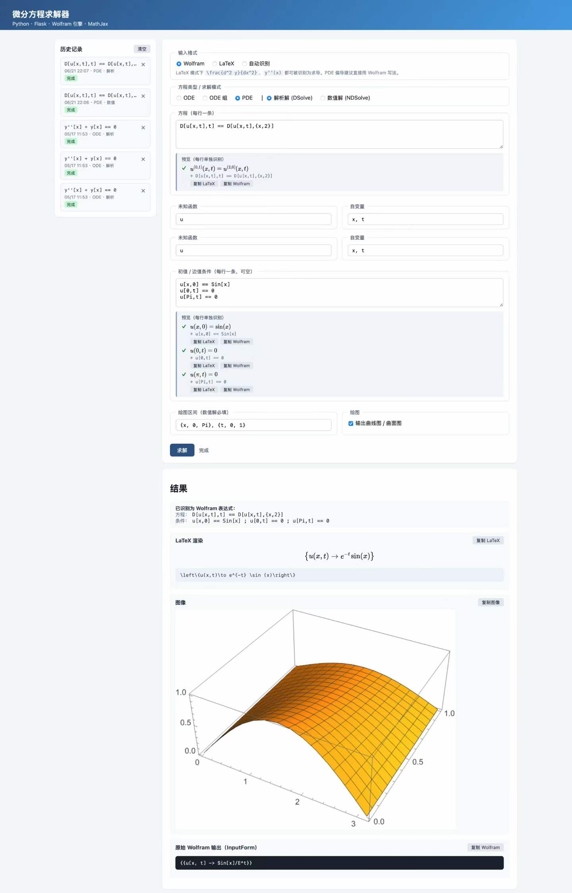

# 微分方程求解器

[](./LICENSE)

一个基于 Python、Flask 和 Mathematica/Wolfram Engine 的 Web 微分方程求解器。用户在浏览器里输入 ODE、ODE 组或 PDE，后端调用本机 Wolfram kernel 求解，并返回公式、图像和原始 Wolfram 输出。

A web-based differential equation solver (ODE / ODE systems / PDE) built with Python, Flask and a local Mathematica / Wolfram Engine kernel.

> 本软件已登记计算机软件著作权，登记名称“微分方程实验台软件 V1.0”，登记号 2026SR0950483。

<p align="center">
  
</p>

## 目录

- [功能概览](#功能概览)
- [环境要求](#环境要求)
- [快速启动](#快速启动)
- [远程使用](#远程使用)
- [使用示例](#使用示例)
- [输入格式](#输入格式)
- [历史记录](#历史记录)
- [动态参数](#动态参数)
- [测试](#测试)
- [项目结构](#项目结构)
- [安全与限制](#安全与限制)
- [排错](#排错)
- [许可证与著作权](#许可证与著作权)

## 功能概览

- 支持 ODE、ODE 组、PDE 的解析解和数值解。
- 支持 Wolfram 语法、LaTeX 输入和自动识别。
- 支持 Mathematica `Plot` / `Plot3D` 输出 PNG，ODE 组曲线自动带函数名图例。
- 支持多行表达式预览，示例一键填入后自动预览。
- 支持左侧历史记录侧栏，记录保存在浏览器 `localStorage`。
- 支持 NDSolve 动态参数滑动条，方便扫参数。
- 支持原始 Wolfram 输出折叠、展开、收起和完整复制。
- 后端包含超时、Wolfram 消息回传、基础危险调用拦截和安全响应头。

## 环境要求

- 操作系统：macOS / Windows / Linux
- Python：3.10 或更新版本
- Wolfram：已安装 Mathematica 或 Wolfram Engine
- Python 依赖：见 `requirements.txt`

后端会按以下顺序查找 `WolframKernel`：

1. 环境变量 `WOLFRAM_KERNEL`
2. 系统 `PATH` 中的 `WolframKernel`
3. 当前操作系统的常见安装目录

Windows 新手建议先看单独教程：[WINDOWS_INSTALL.md](./docs/WINDOWS_INSTALL.md)。

## 快速启动

获取代码：

```bash
git clone https://github.com/Tantalum7x/differential-equation-solver.git
cd differential-equation-solver
```

macOS / Linux：

```bash
python3 -m venv .venv
.venv/bin/pip install -r requirements.txt
.venv/bin/python app.py
```

Windows PowerShell：

```powershell
py -3 -m venv .venv
.\.venv\Scripts\python.exe -m pip install -r requirements.txt
.\.venv\Scripts\python.exe app.py
```

启动后访问：

```text
http://127.0.0.1:5001
```

修改端口：

```bash
PORT=5050 .venv/bin/python app.py
```

Windows PowerShell：

```powershell
$env:PORT="5050"
.\.venv\Scripts\python.exe app.py
```

## 远程使用

默认服务只监听 `127.0.0.1`，只能本机访问。如果团队里只有一台电脑安装了 Mathematica，可以让这台电脑作为主机运行后端，其他人通过浏览器访问。

### 局域网访问

主机运行：

```bash
ACCESS_TOKEN=demo123 HOST=0.0.0.0 PORT=5001 .venv/bin/python app.py
```

Windows PowerShell：

```powershell
$env:ACCESS_TOKEN="demo123"
$env:HOST="0.0.0.0"
$env:PORT="5001"
.\.venv\Scripts\python.exe app.py
```

同一局域网的朋友访问：

```text
http://主机IP:5001
```

页面会显示“远程访问口令”输入框，填入 `ACCESS_TOKEN` 的值即可。

### 公网临时演示

公网演示推荐使用 Cloudflare Quick Tunnel。先安装 `cloudflared`：

```bash
brew install cloudflared
```

保持后端只监听本机，并启用访问口令：

```bash
ACCESS_TOKEN=demo123 HOST=127.0.0.1 PORT=5001 .venv/bin/python app.py
```

另开终端启动公网映射：

```bash
cloudflared tunnel --url http://127.0.0.1:5001
```

命令会输出一个 `https://...trycloudflare.com` 地址，把这个地址和访问口令发给朋友即可。朋友电脑上只需要浏览器，不需要安装 Mathematica。

公网演示时必须设置 `ACCESS_TOKEN`，并建议保持 `HOST=127.0.0.1`，让 Cloudflare Tunnel 转发到本机端口。

本机直接访问 `http://127.0.0.1:5001` 或 `http://localhost:5001` 时，即使设置了 `ACCESS_TOKEN`，也不需要输入访问口令；通过 Cloudflare Tunnel 公网地址访问时仍然需要口令。

## 使用示例

前端页面内置了 5 个示例，每个示例都有“应用此示例”按钮，可以自动填入字段并立即显示预览。

### 示例 1：Wolfram ODE

| 字段 | 内容 |
|---|---|
| 输入格式 | Wolfram |
| 方程类型 | ODE |
| 求解模式 | 解析解（DSolve） |
| 方程 | `y''[x] + y[x] == 0` |
| 未知函数 | `y` |
| 自变量 | `x` |
| 条件 | 空 |

预期输出：$y(x) = c_1 \cos(x) + c_2 \sin(x)$。

### 示例 2：Wolfram 初值

| 字段 | 内容 |
|---|---|
| 输入格式 | Wolfram |
| 方程类型 | ODE |
| 求解模式 | 解析解（DSolve） |
| 方程 | `y''[x] + y[x] == 0` |
| 未知函数 | `y` |
| 自变量 | `x` |
| 条件 | `y[0] == 1`<br>`y'[0] == 0` |

预期输出：$y(x) = \cos(x)$。

### 示例 3：ODE 组数值解

| 字段 | 内容 |
|---|---|
| 输入格式 | Wolfram |
| 方程类型 | ODE 组 |
| 求解模式 | 数值解（NDSolve） |
| 方程 | `x'[t] == y[t]`<br>`y'[t] == -x[t]` |
| 未知函数 | `x, y` |
| 自变量 | `t` |
| 条件 | `x[0] == 1`<br>`y[0] == 0` |
| 绘图区间 | `{t, 0, 2 Pi}` |
| 绘图 | 勾选 |

预期输出：sin/cos 曲线 PNG，并带函数名图例。

### 示例 4：PDE 数值解

| 字段 | 内容 |
|---|---|
| 输入格式 | Wolfram |
| 方程类型 | PDE |
| 求解模式 | 数值解（NDSolve） |
| 方程 | `D[u[x,t],t] == D[u[x,t],{x,2}]` |
| 未知函数 | `u` |
| 自变量 | `x, t` |
| 条件 | `u[x,0] == Sin[x]`<br>`u[0,t] == 0`<br>`u[Pi,t] == 0` |
| 绘图区间 | `{x, 0, Pi}, {t, 0, 1}` |
| 绘图 | 勾选 |

预期输出：3D 曲面图。

### 示例 5：LaTeX ODE

| 字段 | 内容 |
|---|---|
| 输入格式 | LaTeX |
| 方程类型 | ODE |
| 求解模式 | 解析解（DSolve） |
| 方程 | `\frac{d^2 y}{dx^2} + y = 0` |
| 未知函数 | `y` |
| 自变量 | `x` |
| 条件 | 空 |

预期输出：$y(x) = c_1 \cos(x) + c_2 \sin(x)$。页面上的“已识别为 Wolfram 表达式”会显示转换后的表达式，方便检查。

## 输入格式

### Wolfram 语法

- 等式用 `==`，不要用 Mathematica 赋值符号 `=`。
- 函数应用用方括号，例如 `y[x]`、`Sin[x]`。
- 求导可写 `y'[x]`、`y''[x]`，也可写 `D[u[x,t], t]`、`D[u[x,t], {x, 2}]`。

### LaTeX 输入

后端通过 Mathematica 内建的 `ToExpression[s, TeXForm]` 解析，并额外处理常见 ODE 写法：

- `\frac{dy}{dx}` 会改写为 `y'(x)`。
- `\frac{d^2 y}{dx^2}` 会改写为 `y''(x)`。
- 在已知 `functions=y, variables=x` 时，裸函数名 `y` 会包装成 `y(x)`。

PDE 偏导的 LaTeX 输入目前没有完整解析，PDE 建议直接使用 Wolfram 语法，例如 `D[u[x,t], x]`。

### 自动识别

如果输入包含反斜杠或常见 LaTeX 控制序列，系统会按 LaTeX 处理；否则按 Wolfram 语法处理。

## 历史记录

- 每次求解后，当前表单内容和返回结果会自动保存到浏览器本地。
- 点击左侧历史项会回填输入框，并恢复当时的结果、提示、原始 Wolfram 输出和图像。
- 历史项只保存在当前浏览器，换浏览器或清空站点数据后不会保留。
- 最多保留最近 16 条；如果包含较大图像导致浏览器存储空间不足，会自动丢弃较旧记录。

## 动态参数

在数值解模式下，前端会尝试识别方程、条件、绘图区间中的未绑定符号。例如：

```text
x''[t] + omega^2 x[t] == 0
```

当未知函数为 `x`、自变量为 `t` 时，`omega` 会被识别为动态参数，页面会自动显示滑动条和数字输入框。提交求解时，原始方程保持不变，前端只在发送请求前临时替换参数值。

## 测试

自动测试程序说明见 [TESTING.md](./docs/TESTING.md)，可复制到前端手测的用例清单见 [TEST_CASES.md](./docs/TEST_CASES.md)。

常用命令：

```bash
.venv/bin/python backend_tests.py --list
.venv/bin/python backend_tests.py
.venv/bin/python backend_tests.py --include-slow
```

默认测试集会跳过较慢的 PDE 3D 绘图用例，`--include-slow` 会包含完整用例。

## 项目结构

```text
.
├── DESIGN.md              # 设计文档
├── README.md              # 项目入口文档
├── backend_tests.py       # 后端自动测试程序
├── requirements.txt       # Flask + wolframclient
├── app.py                 # Flask 入口，路由 /、/preview、/solve
├── solver.py              # 核心求解逻辑
├── wolfram_session.py     # WolframLanguageSession 单例
├── templates/index.html   # 输入表单 + 结果展示
├── static/
│   ├── app.js             # 前端交互
│   └── style.css          # 页面样式
├── LICENSE                # MIT 许可证
└── docs/
    ├── WINDOWS_INSTALL.md # Windows 安装教程
    ├── TESTING.md         # 自动测试说明
    ├── TEST_CASES.md      # 前端手测用例清单
    └── screenshot.jpg     # 界面截图
```

## 安全与限制

- 后端会拦截明显危险的 Wolfram 调用，例如进程、文件、网络、外部执行、二次求值等。
- 远程访问时建议设置 `ACCESS_TOKEN`；设置后公网/局域网访问 `/preview` 和 `/solve` 都需要携带访问口令。本机直连 `127.0.0.1` / `localhost` 会自动免口令。
- Wolfram 求值有超时限制：预览约 8 秒，求解约 25 秒，绘图约 35 秒。
- 同一进程共享一个 Wolfram kernel，并用执行锁避免多个请求交错覆盖状态。
- 临时解变量使用唯一符号，并在求解后清理。
- 这不是完整沙箱。公网演示必须设置 `ACCESS_TOKEN`，并建议通过 Cloudflare Tunnel 转发本机端口，不要直接裸露 Flask 服务。

## 排错

- `Failed to communicate with kernel`：上一次运行残留了 kernel 进程，重启应用或结束残留 `WolframKernel` 后再试。
- 首次请求慢：WolframLanguageSession 首次启动需要几秒，`app.py` 已在启动时预热。
- Kernel 路径不对：设置 `WOLFRAM_KERNEL` 环境变量指向本机 `WolframKernel`。
- 端口被占：修改 `PORT`，或结束占用 5001 的旧进程。
- 朋友无法访问主机：确认主机用 `HOST=0.0.0.0` 启动、双方在同一局域网、防火墙允许 Python 监听端口。
- Cloudflare Tunnel 没有公网地址：确认已安装 `cloudflared`，并运行 `cloudflared tunnel --url http://127.0.0.1:5001`。
- 访问口令错误：确认浏览器页面里的口令和主机启动时的 `ACCESS_TOKEN` 完全一致。
- `DSolve 未化简`：方程可能没有闭式解析解，改用数值解模式，并补齐初值和绘图区间。

## 许可证与著作权

本项目以 [MIT 许可证](./LICENSE) 开源。

Copyright (c) 2026 贾子朋。本软件已登记计算机软件著作权（登记名称“微分方程实验台软件 V1.0”，登记号 2026SR0950483）。

Mathematica 与 Wolfram Engine 是 Wolfram Research 的商业软件，本项目不包含也不分发它们，使用者需自行安装并遵守其许可条款。
